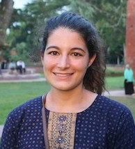

# WiDS Raleigh and Nashville

## Data Science in Coupled Human and Natural Systems

### April 22, 2021
### 10:00 am - 12:00 pm ET

Please join us as we explore topics of data science in coupled human and natural systems and highlight the work of exceptional women data scientists in this field. 

This is a virtual event. Please register here. 

## Agenda

The full agenda for this event is available here. 

## Speakers

**Keynote Speaker: Dr. Hiba Baroud**

Dr. Hiba Baroud is an assistant professor in the Department of Civil and Environmental Engineering at Vanderbilt University and the Littlejohn Dean's Faculty Fellow.  Her work explores data analytics and statistical methods to measure and analyze the risk, reliability, and resilience in critical infrastructure systems.  In particular, she has studied data-driven Bayesian methods to predict the occurrence of disruptive events in infrastructure systems and stochastically model the recovery process of the physically disrupted system as well as other interdependent and indirectly impacted systems. She also developed decision analysis tools to assess different preparedness and recovery investment strategies for the protection of civil infrastructures.

**Graduate Student Speaker: Kelsea Best**

Kelsea Best is a PhD candidate in Earth and Environmental Science at Vanderbilt University in Nashville, TN. Her research focuses on using quantitative methods to study environmental and climate migration in coastal Bangladesh. 

**Graduate Student Speaker: Zeynab Jouzi**

**Undergraduate Student Speaker: ** 

## Note About This Event

WiDS Raleigh and Nashville is an independent event organized by Kelsea Best and Zeynab Jouzi to coincide with the annual Women in Data Science (WiDS) Worldwide conference hosted by Stanford University and an estimated 150+ locations worldwide. All genders are invited to attend WiDS events, which feature outstanding women doing outstanding work.
